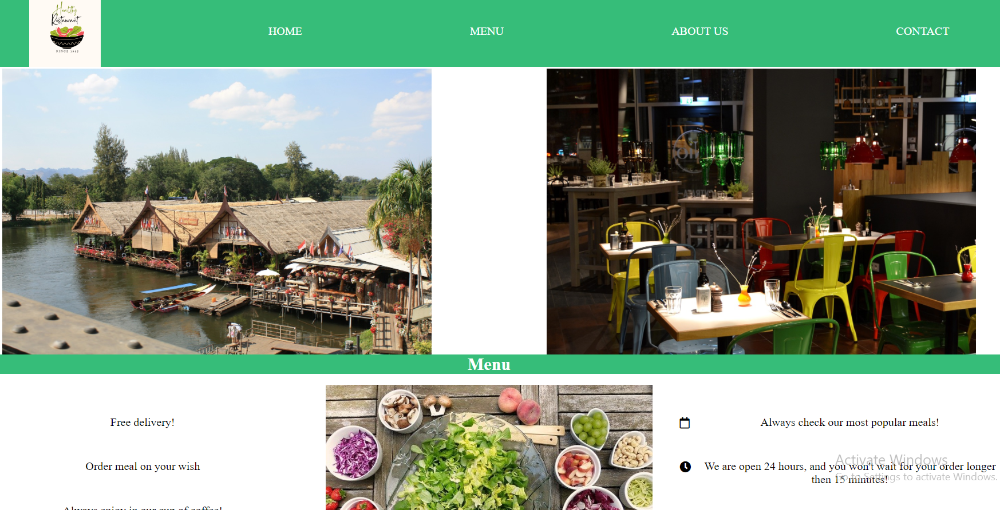
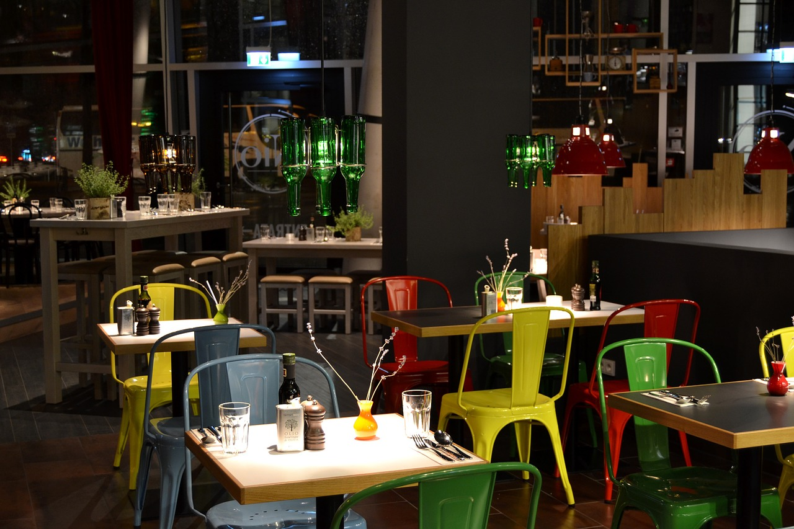

# Build a a Product Landing Page

This is a solution to the [Build a Product Landing Page](https://restaurant-product-landing-page.netlify.app/).
FreeCodeCamp projects help you improve your coding skills by building realistic projects.

## Table of contents

- [Overview](#overview)
  - [Screenshot](#screenshot)
  - [Links](#links)
- [My process](#my-process)
  - [Built with](#built-with)
  - [What I learned](#what-i-learned)
  - [Continued development](#continued-development)
- [Author](#author)

## Overview

This projects should have:

- nav bar always on the top of viewport
- at least one media query.
- should utilize CSS flexbox at least once.
  -embedded video

### Screenshot



### Links

- Solution URL: [https://github.com/Holllyyyy/product-landing-page](https://github.com/Holllyyyy/product-landing-page)
- Live Site URL: [https://restaurant-product-landing-page.netlify.app/](https://restaurant-product-landing-page.netlify.app/))

## My process

I started with writing HTML where I added nav bar with links and logo. Than I made few sections, and inside that sections text,pictures.

```html
<figure class="figcontainer">
  
</figure>
<!-- I used figure cause its much better for accessibility and its more semantic-->
<div class="video">
  <iframe
    width="420"
    height="345"
    src="https://youtube.com/embed/PZ4pctQMdg4"
    id="video"
  >
  </iframe>
</div>
<!---This is how I posted video for youtube, i added inside url embed---->
<section id="menu">
  <h2>Menu</h2>
  <div class="menu-wrapper">
    <div class="menu-container">
      <i class="fas fa-truck"></i>
      <p class="describe">Free delivery!</p>
      <i class="fas fa-utensils"></i>
      <p class="describe">Order meal on your wish</p>
      <i class="fas fa-coffee"></i>
      <p class="describe">Always enjoy in our cup of coffee!</p>
    </div>
    <!---Here I used font awesome website for icons--->
  </div>
</section>
```

After it I moved on my style. I make css folder, and wrote CSS3.
I started with this:

```css
* {
  padding: 0;
  margin: 0;
  box-sizing: border-box;
  font-family: "sans-serif, Franklin Gothic Medium", "Arial Narrow", Arial;
} /*this is always needed to be put when writing any html*/

body {
  width: 100%;
  min-height: 100vh;
} /*this also is fundamental for any website*/

header {
  position: sticky;
  top: 0;
  z-index: 999;
  width: 100%;
  background-color: rgb(182, 233, 182);
  color: black;
} /*here I put postion sticky cause its much better fit then fixed one, where I used top to be always on top , z-indexx to make it 
    on top always, width of 100% to be from right-left*/

#header-img {
  display: flex;
  height: 100px;
}
/*I tried to use display block, but it didnt work, so I used flex, with height of 100px, so logo img will fit to nav bar.*/

#nav-bar {
  width: 100%;
  background-color: rgb(54, 189, 121);
  height: 100px;
  display: flex;
  align-items: center;
} /* this is nav bar with all of his links inside, where I put width of 100% so it covers all horizontally and height of 100 px, display flex giving
them to be in one line, and align-items to center so they are centered*/
#nav-bar > ul {
  width: 100%;
  display: flex;
  justify-content: space-around;
  align-items: center;
  list-style-type: none;
} /* this is nav bar like a parent and ul like his child, we are going in all what is inside nav bar, his child what is ul , where we have few lists, we have to make flex so we will get all in line and space around between their lists-links , use of list style none is to remove lists from nav bar
and be horizontal*/

.nav-link {
  text-decoration: none;
  color: #ffffff;
  text-transform: uppercase;
  font-weight: 4em;
} /* nav link is actually links who we wants to style */

#home {
  display: flex;
  width: 100%;
  flex-direction: column;
} /*home is first section, and I want to give it flex and width of 100 and direction column how we can put pictures here*/
.homepage {
  display: flex;
  width: 100%;
  justify-content: space-between;
  text-align: center;
} /*this is child of home, who consists of 2 figure tags, n inside it img, n here is one more child h2*/
.figcontainer {
  width: 50%;
  display: flex;
} /*is child of homepage, figure, but also parent of img, I want to put width of 50% cause I have two img inside so they will take 50% of parent*/
.pic1 {
  display: block;
  max-width: 100%;
  height: 400px;
  margin: auto;
} /* Im giving every picture display block with max width of 100 to be sure that picture wont go out of his parent, margin auto to make them cetered n height of 400px*/

.container {
  width: 30%;
  display: flex;
  flex-direction: column;
} /*taking 30% of his parent, cause there is three img around*/
.figurepic {
  display: block;
  max-width: 100%;
  margin-bottom: 7px;
  height: 300px;
} /*same rule as earlier , margin used just for making space n text separated*/
```

### Built with

- Semantic HTML5 markup
- CSS custom properties
  -CSS Flexbox

### What I learned

While working on this project I learned :
- how to make nav bar using lists and flexbox
-how to set nav bar to be fixed on top of the viewport
-to connect nav bar with all section when its being clicked
-to change color on smaller screens
-how to put 3 images in one line , 2 images.
-how to use icons from font awesome website


### Continued development

I will continue next with Build a Technical Documentation Page, from freeCodeCamp. I want to practice and improve my HTML5 and CSS3 skills.

## Author

- Website - [Svetlana Jokic](https://my-portfolio-hollyy.netlify.app/)
- Frontend Mentor - [@Holllyyyy](https://www.frontendmentor.io/profile/Holllyyyy)
- Twitter - [@svetlanajokic](https://twitter.com/svetlanajokic)
- LinkedIn - [@Svetlana Jokic](https://www.linkedin.com/in/svetlana-jokic-787432100/)
- FreeCodeCamp - [@hollyy](https://www.freecodecamp.org/hollyy)
